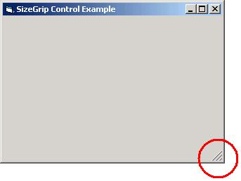



## SizeGrip Control

### Description

Ever wish you could add a Sizing Grip to your form without the added overhead of the ComCtl32? This control provides a nice work around and builds on the code of Karl Peterson’s subclassing technique to provide a lightweight solution that is only ~4kb. Simply drop on your form and of you go...
 
### More Info
 

             |
---                |---
**Submitted On**   |2005-03-17 15:14:12
**By**             |[TerriTop](https://github.com/Planet-Source-Code/PSCIndex/blob/master/ByAuthor/territop.md)
**Level**          |Beginner
**User Rating**    |4.0 (8 globes from 2 users)
**Compatibility**  |VB 3\.0, VB 4\.0 \(16\-bit\), VB 4\.0 \(32\-bit\), VB 5\.0, VB 6\.0, VBA MS Access, VBA MS Excel
**Category**       |[Custom Controls/ Forms/  Menus](https://github.com/Planet-Source-Code/PSCIndex/blob/master/ByCategory/custom-controls-forms-menus__1-4.md)
**World**          |[Visual Basic](https://github.com/Planet-Source-Code/PSCIndex/blob/master/ByWorld/visual-basic.md)
**Archive File**   |[SizeGrip\_C1865593172005\.zip](https://github.com/Planet-Source-Code/territop-sizegrip-control__1-59523/archive/master.zip)

